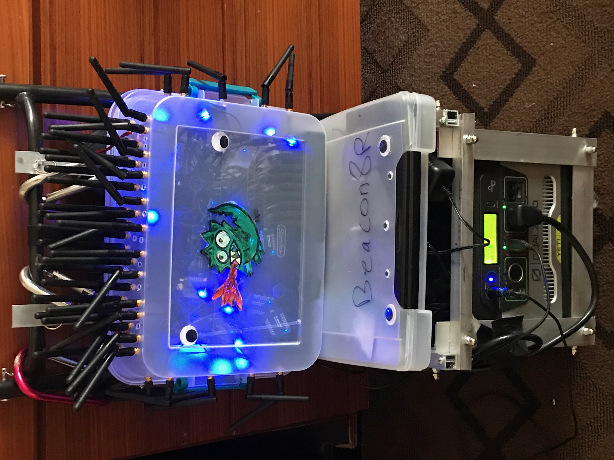
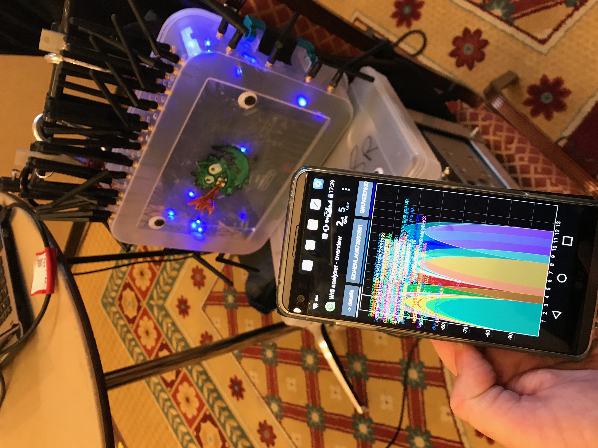

# Beacon8r

## As seen at DefCon 26 in the Hardware Hacking Village - Saturday at 5pm.
### Here are my [DefCon 26 Slides](Wi-Fi%20Beacons%20will%20give%20you%20up%20Defcon26%20slides.pdf)

# Why 
To make people giggle and stress test wifi analyzer tools. Also rick rolling might be involved. Also to inspire people to get into playing with ESP8266's.

# Info 
The top main part is made up of 44 ESP8266's -WeMos D1 Pro mini's to be exact. Some versions come with antennas so that's what I got.
The secondary part is 13 NodeMCU ESP8266's which are sturdy units with lots of pinouts.

**This project pushes roughly a million unique SSIDs every minute.** In theory. Real numbers in the next few weeks.
It uses 44 ESP8266's and each one is advertising almost 3k SSID's every 6-8 seconds for a total of 130k unique SSID's every 6-8 seconds  with unique MAC addresses per SSID and each SSID get's a numeric suffix.

That's what the main unit on top does. In the top there are 44 ESP8266 each hooked up to one half of a usb to mini power splitter cable into an anker powered usb hub running off of mains. I checked and wiring them all up 12 volt out to 12 volt in of hub wasn't much of a power savings. Weight savings would be worth it though. 

The secondary unit on bottom in the flat box broadcasts a rick roll, the trevor memorial project and some books.

FYI you can use emoji's as access point names, just not in the main unit section. 

So there is a total of 57 ESP8266's here and when all powered up it draws 46-49 watts. Yes lithium ion batteries are much lighter but I didn't have time/money to go with Li-ion for it all. Plus, the usb battery packs I got in bulk for this weren't up to the job so instead of ordering more I went lead acid.

# Unit

# Action Shot

# Notes
NodeMCU modules tend to be less power hungry than WeMos D1 mini Pro's But I don't have hard data to back that up. Just a gut feeling and a couple data points.

If you re-create this - don't put antennas so close to your body and especially don't use more powerful antenna's unless you know what you are doing. 

Also, don't run something like the main unit in a normal wifi area. The antenna's aren't that powerful but a bunch of them near a 2.4 ghz only device might muddy the water. It did crash someones phone when they were using a wifi analyzer but I don't know phone brand or app version/name.  I did manage to crash a wristband esp8266 based wifi access point lister/enumerator that one person was wearing. 

I was able to connect to a different person's access point who was standing right next to me because his access point had a 9db antenna.

In general when you are playing with these use judgement and keep them a bit away from your body. I wouldn't power one up and put it in your pocket but that's just me.

# Attributions
I tried to note in each file where I borrowed/adapted code from. I'll take the blame for the python code though. 

# How much does it way?
Too much.
